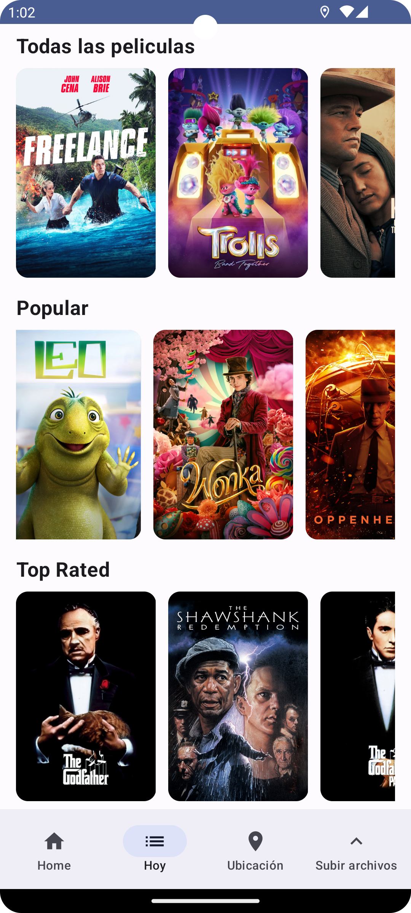
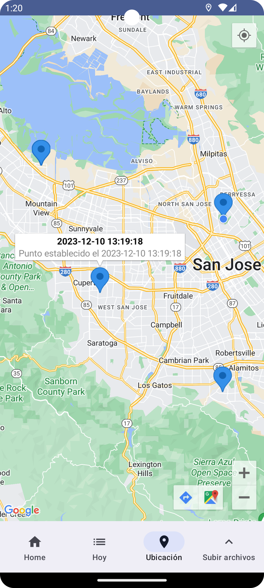
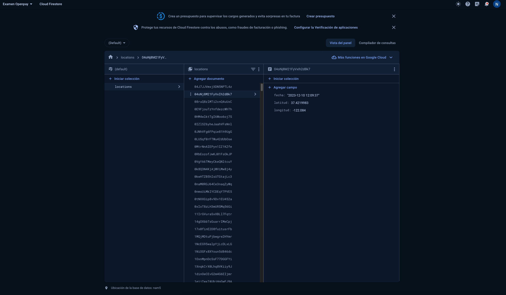
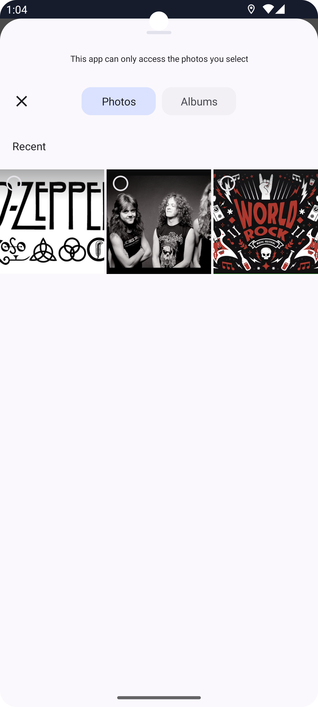
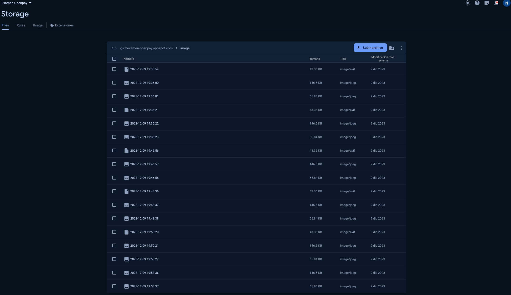

# PruebaTecnicaOpenPay
Prueba de openpay

## A contibuacion se muestras el flujo de pantallas de la aplicacion

## Captura del home profile

## Captura del listado de peliculas listado por popular top y completo

## Captura de carga de puntos en el mapa recuperado de firestore

## Data registada en el dashboard de firebase

## Pantallas para la subida de imágene a firesstore

## Pantalla normal antes de seleccionar imagenes

## Picker para seleccionar imagenes

## Imágenes selecionadas para la subida

## Resultado de la subida de varias imagenes vista desde el dashboard

# Documentación

**PruebaTecnicaOpenPay** Es una aplicación hecha totalmente en kotlin usando Jetpack Compose en el que se muestra el uso de de distintas tecnologias
entre la cuales destaca Firebase Storage,Firestore y Hilt entre otras.

## Referencias

- <https://developer.android.com/jetpack/compose/documentation?hl=es-419> para Jeppack compose.

- <https://firebase.google.com/?hl=es> para Firebase.

- <https://developer.android.com/training/dependency-injection/hilt-android?hl=es-419> para Hilt.

## Dependencias

Para que el proyecto funcione correctamete es necesario tener instalado el NDk y Cmake para el interprete C++.

## Consideraciones

- Cualquier sugerencias es bienvenida.
- Sientase libre de hacer un pullrequest para mejoras de código.
- Para entender el proyecto es necesario tenr conocimientos de JetPack Compose
- Conocimientos de android.
- Conocimientos basicos de C++.
- Instalar Cmake y NDK.
- Clone este repositiorio y cambiese a la rama `master` y a trabajar :).

