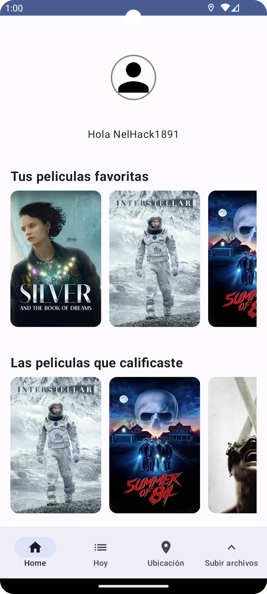

# PruebaTecnicaOpenPay
Prueba de openpay

## A contibuacion se muestras el flujo de pantallas de la aplicacion

## Captura del home profile

## Captura del listado de peliculas listado por popular top y completo

## Captura de carga de puntos en el mapa recuperado de firestore

## Data registada en el dashboard de firebase

## Pantallas para la subida de imágene a firesstore

## Pantalla normal antes de seleccionar imagenes

## Picker para seleccionar imagenes

## Imágenes selecionadas para la subida

## Resultado de la subida de varias imagenes vista desde el dashboard

